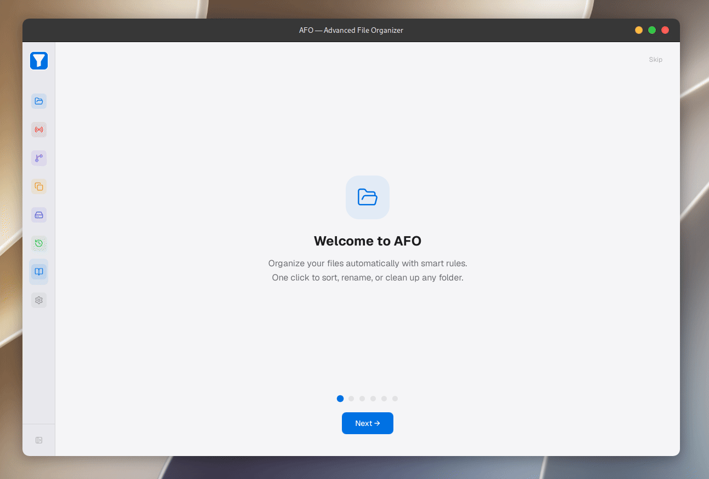

<div align="center">


# AFO — Advanced File Organizer

**Stop drowning in Downloads. Let your files sort themselves.**

[](https://github.com/Himath-Rajapaksha/AFO/releases)
[](LICENSE)
[](#-installation)
[](https://tauri.app)
[](https://github.com/Himath-Rajapaksha/AFO/stargazers)

<br/>



<br/><br/>

**[Download](#-installation)** · **[Features](#-features)** · **[Quick Start](#-quick-start)** · **[Roadmap](#-roadmap)**

</div>

---

## Why AFO?

Your Downloads folder is a crime scene. Screenshots next to invoices next to
that PDF you needed six months ago. AFO watches, sorts, renames, and
de-duplicates your files automatically — with a visual rule builder for when
"automatically" needs a little steering, and full undo for when it doesn't
go your way.

<br/>

## Features

<table>
<tr>
<td width="50%" valign="top">

### Organize
- **Smart Sort** — by extension, date, or metadata, one click
- **Batch Rename** — pattern templates with live preview
- **Visual Rule Builder** — drag-and-drop conditions on a React Flow canvas
- **Metadata-Aware** — reads EXIF (camera, GPS) and audio tags (artist, album)

</td>
<td width="50%" valign="top">

### Automate & Protect
- **Real-Time Watching** — organize as files land, per-directory opt-in
- **Scheduled Runs** — cron-based automation, 4 action types
- **Duplicate Detection** — blake3 hashing, quarantine before delete
- **Full Undo/Redo** — every operation is reversible, bulk or single

</td>
</tr>
</table>

<br/>

## Quick Start

```bash
# Linux (.deb)
sudo dpkg -i afo_3.0.3_amd64.deb

# Linux (.rpm)
sudo rpm -i afo-3.0.3.x86_64.rpm

# Windows
# Download AFO-3.0.3-setup.exe from Releases and run it
```

Open AFO → point it at a folder → hit **Scan** → review the preview → **Execute**.
Or just turn on **Real-Time Watching** and forget it exists.

<br/>

## Installation

| Platform | Format | Status |
|---|---|---|
| Linux | `.deb` / `.rpm` | Available |
| Windows | `.exe` | Available (installer via NSIS coming soon) |
| macOS | `.dmg` | Configured, not yet built — contributions welcome |

<br/>

## Roadmap

- [ ] Cloud sync — Dropbox, Google Drive, OneDrive
- [ ] Auto-updates
- [ ] Rule import/export
- [ ] History search & filtering
- [ ] Full a11y pass (ARIA, keyboard nav)
- [ ] Localization

Vote on priorities → [open an issue](https://github.com/Himath-Rajapaksha/AFO/issues)

<br/>

## Contributing

PRs welcome. Check [open issues](https://github.com/Himath-Rajapaksha/AFO/issues)
or pick something off the roadmap above.

<br/>

<div align="center">

**Built with Tauri, React, and a genuine hatred of messy folders.**

⭐ **[Star this repo](https://github.com/Himath-Rajapaksha/AFO)** if AFO cleaned up your life a little.

</div>
